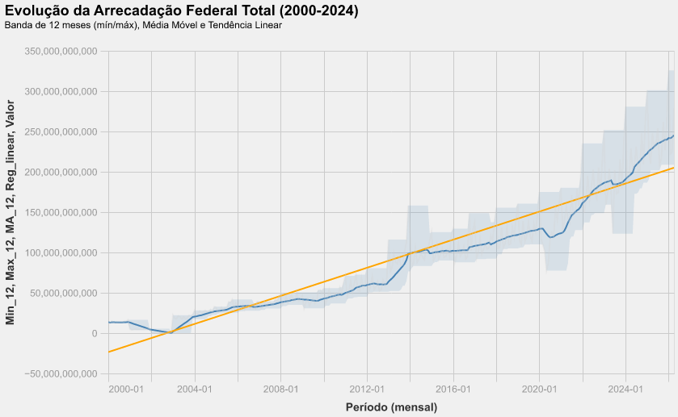
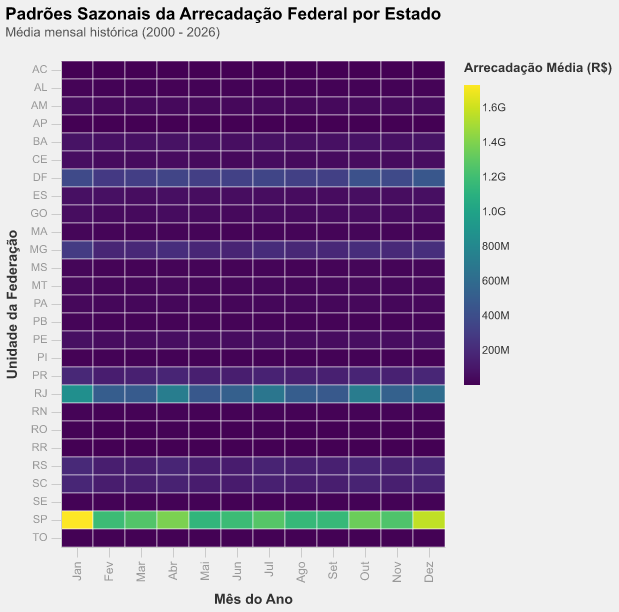

# Relatório
## Identificação

- **Nome**: <mark>`Nícolas Rosenthal Dal Corso`</mark>
- **Cartão UFRGS:** <mark>`00304709`</mark>

## Dados utilizados

1. **Dataset 1**: <mark>[Receita Federal: Resultado da Arrecadação](https://dados.gov.br/dados/conjuntos-dados/resultado-da-arrecadacao)</mark>
    * **Descrição curta**: <mark>`Dados da arrecadação de impostos e contribuições federais administrados pela Secretaria Especial da Receita Federal do Brasil (RFB). (2000-2026)`</mark>

## Código-fonte da visualização
- **Arquivo principal**: <mark>`visualizations.py`</mark>

## Imagens das visualizações geradas

### Evolução da arrecadação federal

#### Descrição da visualização
`Série temporal mostrando a evolução da arrecadação federal total (2000-2024). O eixo vertical representa o valor arrecadado, enquanto o eixo horizontal representa o tempo, em intervalos anuais. Foram calculadas médias móveis mensais para investigar tendências e sazonalidade, assim como a aplicação de um modelo simples de regressão linear para demonstrar o comportamento do crescimento.`

#### Legenda (*caption*)
`A linha cinza clara representa a série original (mensal). A área azul translúcida delimita o intervalo entre o mínimo e o máximo dos últimos 12 meses, evidenciando a volatilidade cíclica ou sazonalidade. A linha azul escura é a média móvel de 12 meses, que suaviza a série e revela a tendência de médio prazo. Por fim, a reta laranja é a regressão linear de todo o período.`

#### Conclusão demonstrada pela visualização
`Crescimento da arrecadação federal ao longo do tempo, com forte sazonalidade anual (picos sempre no primeiro trimestre). Observa-se inflexão negativa em 2009, talvez reflexo da Crise de 2008. O período de 2013 até 2015 mostrou elevada recuperação da arrecadação de impostos. Podemos perceber outra grande queda em 2020, possivelmente devido à pandemia de COVID-19. Notamos, por fim, que a partir de abril de 2022, a arrecadação é superior ao modelo de regressão linear que considera todo o período, mostrando uma tendência positiva.`

### *Temporal Series*:Evolução da Arrecadação Federal

#### Descrição da visualização
`Série temporal mostrando a evolução da arrecadação federal total (2000-2024). O eixo vertical representa o valor arrecadado, enquanto o eixo horizontal representa o tempo, em intervalos anuais. Foram calculadas médias móveis mensais para investigar tendências e sazonalidade, assim como a aplicação de um modelo simples de regressão linear para demonstrar o comportamento do crescimento.`

#### Legenda (*caption*)
`A linha cinza clara representa a série original (mensal). A área azul translúcida delimita o intervalo entre o mínimo e o máximo dos últimos 12 meses, evidenciando a volatilidade cíclica ou sazonalidade. A linha azul escura é a média móvel de 12 meses, que suaviza a série e revela a tendência de médio prazo. Por fim, a reta laranja é a regressão linear de todo o período.`

#### Conclusão demonstrada pela visualização
`Crescimento da arrecadação federal ao longo do tempo, com forte sazonalidade anual (picos sempre no primeiro trimestre). Observa-se inflexão negativa em 2009, talvez reflexo da Crise de 2008. O período de 2013 até 2015 mostrou elevada recuperação da arrecadação de impostos. Podemos perceber outra grande queda em 2020, possivelmente devido à pandemia de COVID-19. Notamos, por fim, que a partir de abril de 2022, a arrecadação é superior ao modelo de regressão linear que considera todo o período, mostrando uma tendência positiva.`

### *Stacked Area*: Partipação Relativa dos Tributos (e o impacto da Lei 10.833/2003)

#### Descrição da visualização
`Gráfico de área empilhada normalizada (*stacked area* somando 100%) mostrando a evolução da participação relativa dos principais tributos federais no período de 2000 a 2026. O eixo vertical representa a proporção percentual de cada tributo na arrecadação total, enquanto o eixo horizontal representa o tempo, em intervalos anuais. Cada cor distinta representa um tributo específico, com a paleta Tableau 10 ordenada pela média histórica de arrecadação. Anotação de evento histórico através de linha vertical tracejada vermelha acompanhada de texto marca a entrada em vigor da Lei nº 10.833/2003, que instituiu o regime não cumulativo da COFINS em fevereiro de 2004.`

#### Legenda (*caption*)
`A largura de cada faixa colorida em um determinado ano representa a fatia percentual daquele tributo no bolo total da arrecadação federal. A linha vermelha tracejada assinala o marco regulatório de 2004 e a anotação contextualiza o evento sobre o gráfico. Observa-se que a categoria "COFINS - DEMAIS" (em tons de azul) possuía participação modesta e estável antes de 2004, porém, a partir desse ponto, sua área se expande grandmente, suplantando o IRPF e o IPI e assumindo a liderança entre os tributos arrecadados, enquanto os demais tributos, como PIS/PASEP e CSLL, mantêm participações relativamente constantes.`

#### Conclusão demonstrada pela visualização
`A visualização demonstra uma mudança estrutural e não-óbvia no sistema tributário brasileiro ocorrida a partir de 2004.`

### *Heatmap*: Padrões Sazonais de Arrecadação por Estado

### Detalhes da visualização
`Mapa de calor (*heatmap*) que cruza as 27 unidades da federação (eixo Y) com os 12 meses do ano (eixo X). Cada célula representa a arrecadação federal média (em R$) daquele estado naquele mês específico, com valores agrupados a partir de todos os anos disponíveis no período (2000 a 2026). A intensidade da cor segue uma escala sequencial do amarelo ao roxo escuro (**viridis**), onde tonalidades mais claras indicam maiores valores médios de arrecadação.`

### Legenda (*caption*)
`No eixo horizontal, os meses estão ordenados cronologicamente de janeiro a dezembro. No eixo vertical, os estados estão listados em ordem alfabética. Células mais claras (amarelas) concentram-se em estados de maior porte econômico (SP, RJ, MG, RS), enquanto células mais escuras (tons de roxo, lilás)) representam estados com menor volume arrecadatório (AC, RR, AP etc.). Observam-se padrões sazonais em todos os estados.`

### Conclusão demonstrada pela visualização
`Embora seja imediata a percepção da concentração absoluta de arrecadação nos estados mais populosos e industrializados (especialmente São Paulo, Rio de Janeiro e Minas Gerais, que aparecem com as cores mais claras consistentemente ao longo do ano), o *insight* não-óbvio revelado pelo heatmap é a **forte e generalizada sazonalidade de primeiro trimestre em todo o Brasil**.`